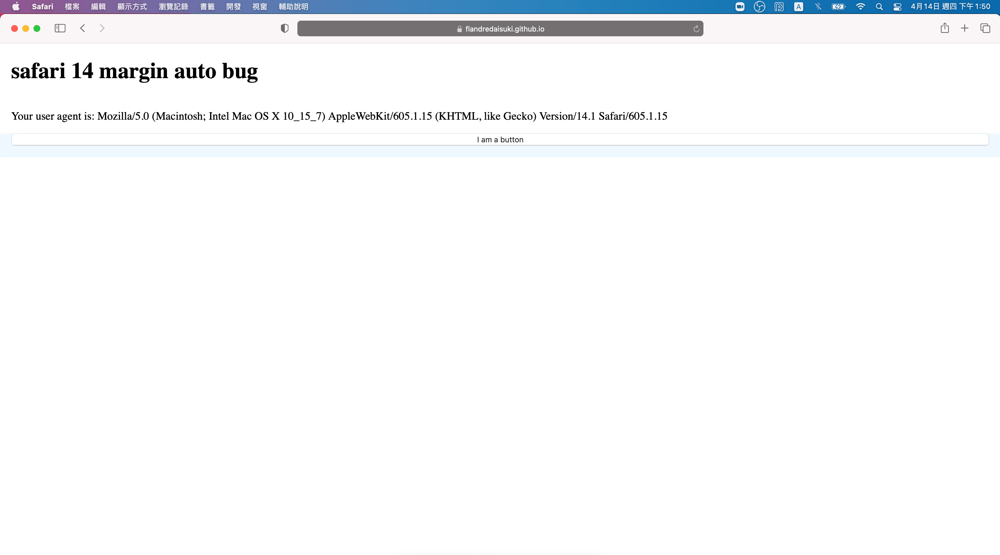

# Safari 14 margin auto bug

|environment|gallery|
|:-:|:-:|
|iOS 14 Safari||
|iOS 13 Safari||
|MacOS Safari 14||

## Solution

```diff
    main {
      position: fixed;
      top: 0;
      left: 0;
      right: 0;
      bottom: 0;
+
+     height: 100%;

      display: grid;
      grid-template-rows: auto auto 1fr;
    }
```
